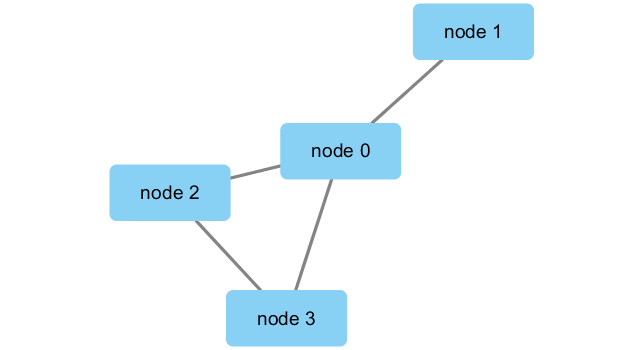
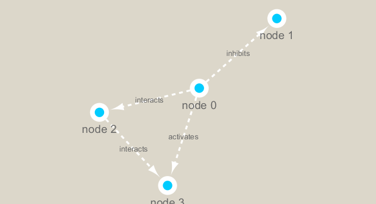

```{r setup, include=FALSE}
knitr::opts_chunk$set(echo = TRUE)
```

## Metagenomics co-occurrence networks
Here examine data from the Tara Ocean project on bactera in ocean water samples from around the world.

We will use the **igraph** package from CRAN and the **RCy3** package from bioconductor to build and visualize networks of this data.
```{r}
# build connection
library(RCy3)
library(igraph)
library(RColorBrewer)

# Test the connection to Cytoscape.
cytoscapePing()

# Check the version
cytoscapeVersionInfo()
```

```{r}
g <- makeSimpleIgraph()
createNetworkFromIgraph(g,"myGraph")
fig <- exportImage(filename="demo", type="png", height=350)

```

```{r}
# switch style
setVisualStyle("Marquee")
fig <- exportImage(filename="demo_marquee", type="png", height=350)

```

```{r}
# what styles do we have?
styles <- getVisualStyleNames()
styles
```

```{r}
# simply plot in R
plot(g)
```

## read data
```{r}
## scripts for processing located in "inst/data-raw/"
prok_vir_cor <- read.delim("virus_prok_cor_abundant.tsv", stringsAsFactors = FALSE)

## Have a peak at the first 6 rows
head(prok_vir_cor)
```

```{r}
g <- graph.data.frame(prok_vir_cor, directed = FALSE)
class(g)
g
plot(g, vertex.size=3, vertex.label=NA)
# send this network to Cytoscape 
createNetworkFromIgraph(g,"myIgraph")
```

## Network querys
```{r}
# query vertex and edge attributes with the V() and E() functions
V(g)
E(g)
```

## Network community detection
```{r}
# find dense sub-graphs within larger network graphs
cb <- cluster_edge_betweenness(g)
cb
plot(cb, y=g, vertex.label=NA,  vertex.size=3)
head(membership(cb))
```

## Node degree
The degree of a node or vertex is its most basic structural property, the number of its adjacent edges
```{r}
# Calculate and plot node degree of our network
d <- degree(g)
hist(d, breaks=30, col="lightblue", main ="Node Degree Distribution")
# For the degree_distribution() function a numeric vector of the same length as the maximum degree plus one is returned. The first element is the relative frequency zero degree vertices, the second vertices with degree one, etc.
plot( degree_distribution(g), type="h" )
```

## central analysis
```{r}
# via page rank
pr <- page_rank(g)
head(pr$vector)
v.size <- BBmisc::normalize(pr$vector, range=c(2,20), method="range")
plot(g, vertex.size=v.size, vertex.label=NA)
```

```{r}
# via degree
v.size <- BBmisc::normalize(d, range=c(2,20), method="range")
plot(g, vertex.size=v.size, vertex.label=NA)
```

```{r}
# via betweenness
b <- betweenness(g)
v.size <- BBmisc::normalize(b, range=c(2,20), method="range")
plot(g, vertex.size=v.size, vertex.label=NA)
```

