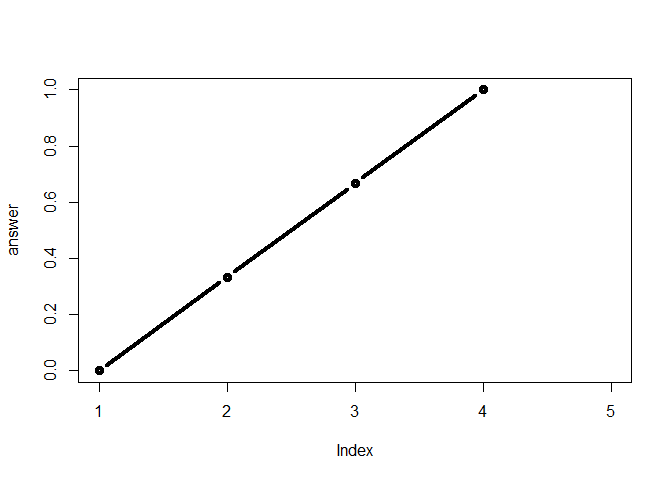

Lab 6 R functions
================
Weixi Chen
10/17/2019

# This is heading 1

This is my work from Lab6 in **BIMM143**.

``` r
# this is to demo a code chunk
plot(1:10)
```

<!-- -->

## Practice reading files (again…)

``` r
read.csv("test1.txt")
```

    ##   Col1 Col2 Col3
    ## 1    1    2    3
    ## 2    4    5    6
    ## 3    7    8    9
    ## 4    a    b    c

``` r
read.csv("test2.txt", sep="$")
```

    ##   Col1 Col2 Col3
    ## 1    1    2    3
    ## 2    4    5    6
    ## 3    7    8    9
    ## 4    a    b    c

``` r
read.table("test3.txt")
```

    ##   V1 V2 V3
    ## 1  1  6  a
    ## 2  2  7  b
    ## 3  3  8  c
    ## 4  4  9  d
    ## 5  5 10  e

## Practice R functions

``` r
add <- function(x, y=1) {
  # Sum the input x and y
  x+y
  }
```

``` r
add(1)
```

    ## [1] 2

``` r
# change the value of y
add(x=1, y=4)
```

    ## [1] 5

``` r
add(1,4)
```

    ## [1] 5

``` r
# add on vector
add(c(1,2,3))
```

    ## [1] 2 3 4

``` r
add(c(1,2,3),4)
```

    ## [1] 5 6 7

## SectionA

``` r
df <- data.frame(a=1:10, b=seq(200,400,length=10),c=11:20,d=NA) 
```

``` r
rescale <- function(x){
  # na.rm=TRUE should be added in range to omit NAs in data.frame
  rng <- range(x, na.rm=TRUE)
  (x-rng[1])/(rng[2]-rng[1])
}
```

``` r
rescale(df$a)
```

    ##  [1] 0.0000000 0.1111111 0.2222222 0.3333333 0.4444444 0.5555556 0.6666667
    ##  [8] 0.7777778 0.8888889 1.0000000

``` r
rescale(df)
```

    ##              a         b          c  d
    ## 1  0.000000000 0.4987469 0.02506266 NA
    ## 2  0.002506266 0.5544417 0.02756892 NA
    ## 3  0.005012531 0.6101365 0.03007519 NA
    ## 4  0.007518797 0.6658312 0.03258145 NA
    ## 5  0.010025063 0.7215260 0.03508772 NA
    ## 6  0.012531328 0.7772208 0.03759398 NA
    ## 7  0.015037594 0.8329156 0.04010025 NA
    ## 8  0.017543860 0.8886104 0.04260652 NA
    ## 9  0.020050125 0.9443052 0.04511278 NA
    ## 10 0.022556391 1.0000000 0.04761905 NA

``` r
rescale2 <- function(x, na.rm=TRUE, plot=FALSE) {
 rng <-range(x, na.rm=na.rm)
 # If function is defined, put return function at very end
 answer <- (x - rng[1]) / (rng[2] - rng[1])
 # If you want to change default setting, put if function
 if(plot) {
 plot(answer, typ="b", lwd=4)
 }
 print("Hello")
 print("is it me you are looking for?")
 print("I can see it in ...")
 return(answer)
}
```

``` r
rescale2(c(1,2,3,4,NA), plot=TRUE)
```

<!-- -->

    ## [1] "Hello"
    ## [1] "is it me you are looking for?"
    ## [1] "I can see it in ..."

    ## [1] 0.0000000 0.3333333 0.6666667 1.0000000        NA
