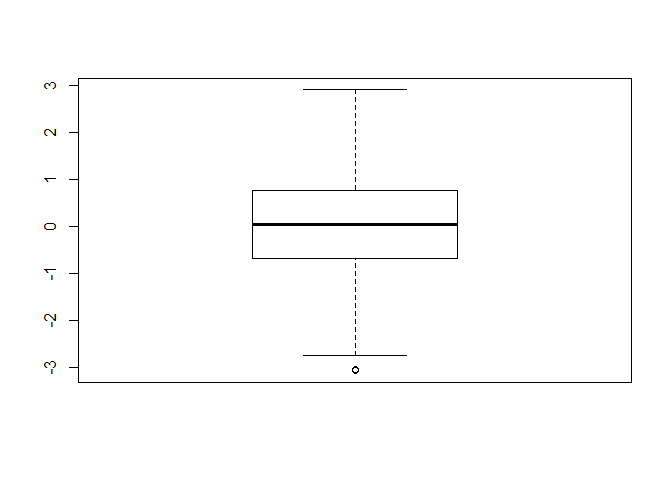
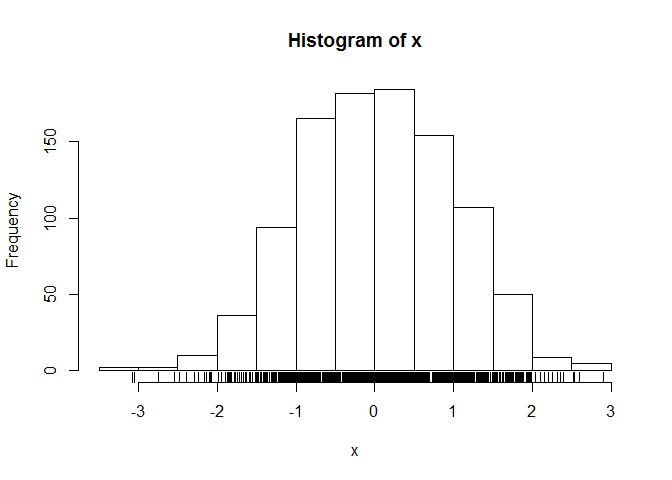
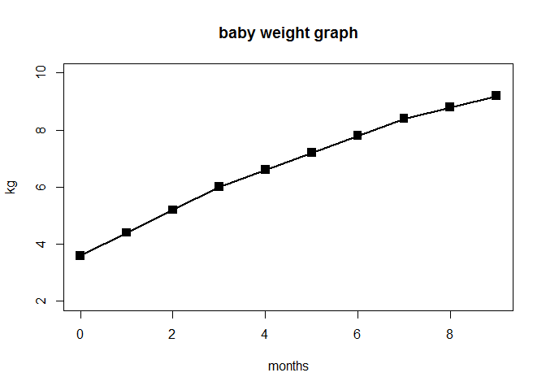
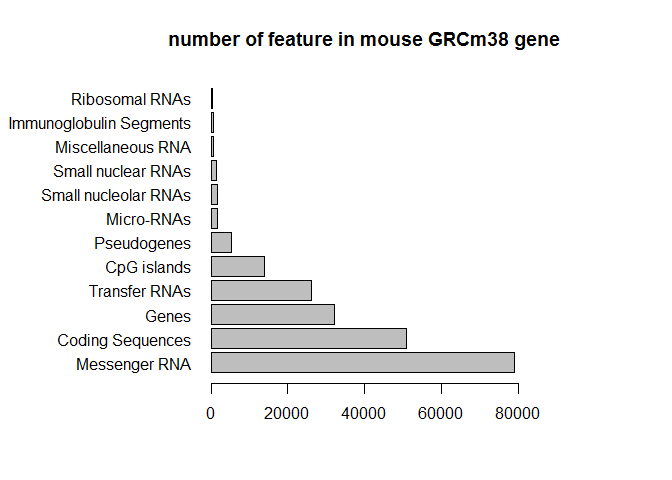
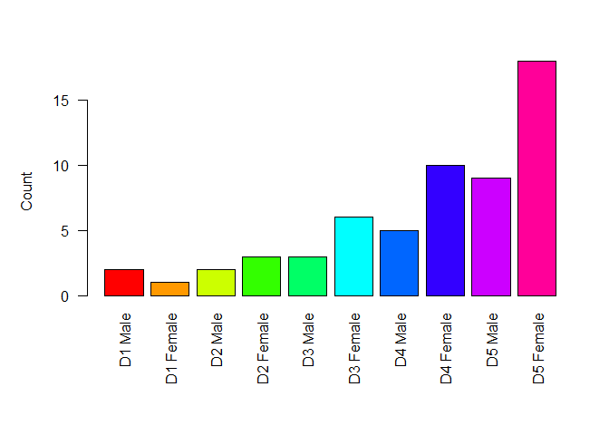
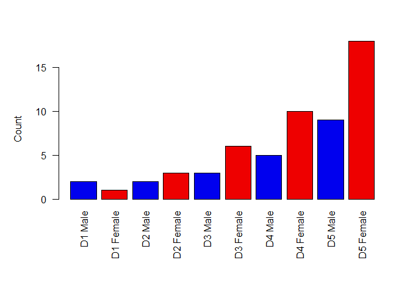
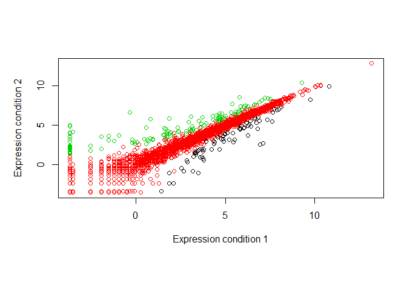
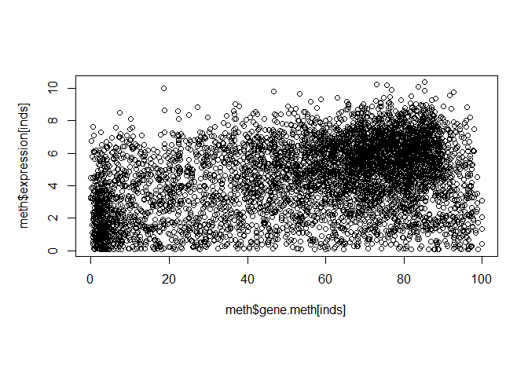
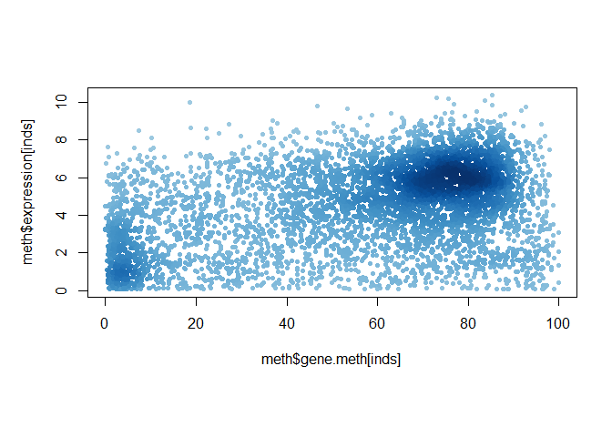
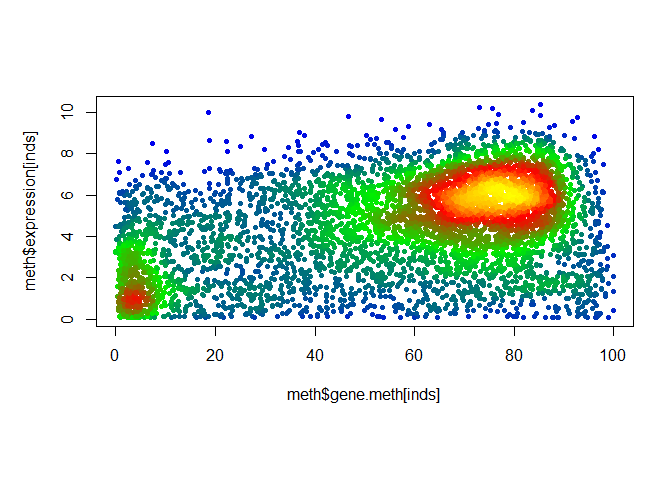

Lab 5: Data exploration and visualization
================
Weixi Chen
Oct 31st, 2019

``` r
# Lab5 Data visualization
x <- rnorm (1000)
mean(x)
```

    ## [1] 0.03220585

``` r
sd(x)
```

    ## [1] 0.9643991

``` r
summary(x)
```

    ##     Min.  1st Qu.   Median     Mean  3rd Qu.     Max. 
    ## -3.07847 -0.68480  0.03065  0.03221  0.75830  2.90317

``` r
boxplot(x)
```

<!-- -->

``` r
hist(x)
rug(x)
```

<!-- -->

``` r
# Section 2A Baby weight graph
baby <- read.table("bimm143_05_rstats/weight_chart.txt", 
                   header = TRUE)
View(baby)
plot(baby$Age, baby$Weight, type="o", pch=15, cex=1.5, lwd=2,
     ylim=c(2,10), xlab="months", ylab="kg", main="baby weight graph")
```

<!-- -->

``` r
# Section 2B Mouse feature
mouse <- read.table("bimm143_05_rstats/feature_counts.txt",
                    sep="\t", header = TRUE)
# or use read.delim
View(mouse)
par(mar=c(5,11,4,8))
barplot(mouse$Count, horiz = TRUE, 
        names.arg = mouse$Feature, las=1, xlim=c(0,80000),
        main = "number of feature in mouse GRCm38 gene")
```

<!-- -->

``` r
# Section 3A Gender color
gender <- read.delim("bimm143_05_rstats/male_female_counts.txt")
View(gender)
# use nrow() to find the argument for rainbow()
par(mar=c(8,5,5,2))
barplot(gender$Count, col=rainbow(nrow(gender)), 
        ylab="Count", names.arg=gender$Sample, las=2, 
        ylim=c(0,16))
```

<!-- -->

``` r
# male in blue, female in red
barplot(gender$Count, col=c("blue2", "red2"), 
        ylab="Count", names.arg=gender$Sample, las=2, 
        ylim=c(0,16))
```

<!-- -->

``` r
#Section 3B Gene expression
genes <- read.delim("bimm143_05_rstats/up_down_expression.txt")
View(genes)
nrow(genes)
```

    ## [1] 5196

``` r
table(genes$State)
```

    ## 
    ##       down unchanging         up 
    ##         72       4997        127

``` r
plot(genes$Condition1, genes$Condition2, col=genes$State, 
     xlab="Expression condition 1", ylab="Expression condition 2")
```

<!-- -->

``` r
#check factor with levels(genes$State)
levels(genes$State)
```

    ## [1] "down"       "unchanging" "up"

``` r
palette(c("red","grey","blue"))

#Section 3C Methylation expression
meth <- read.delim("bimm143_05_rstats/expression_methylation.txt")
View(meth)
nrow(meth)
```

    ## [1] 9241

``` r
#restrict to expression above 0
inds <- meth$expression > 0
plot(meth$gene.meth[inds],meth$expression[inds])
```

<!-- -->

``` r
dcols <- densCols(meth$gene.meth[inds],meth$expression[inds])
plot(meth$gene.meth[inds],meth$expression[inds], 
     col=dcols, pch=20)
```

<!-- -->

``` r
#give custom color
dcols.custom <- densCols(meth$gene.meth[inds],meth$expression[inds],
                         colramp = colorRampPalette(c("blue2","green2","red","yellow")))
plot(meth$gene.meth[inds],meth$expression[inds], 
     col=dcols.custom, pch=20)                         
```

<!-- -->
